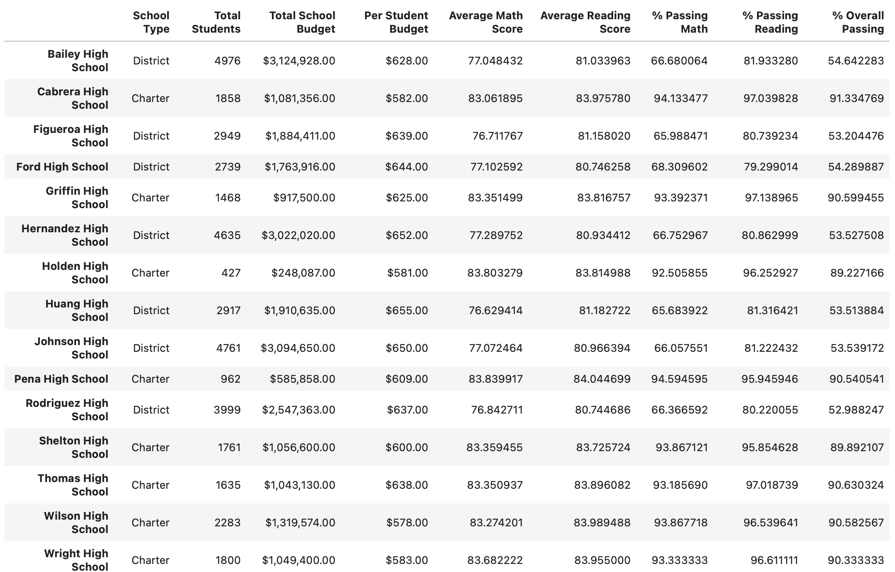
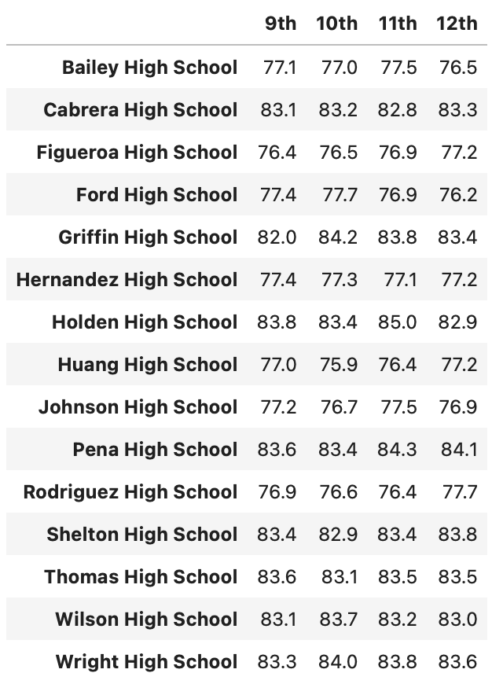
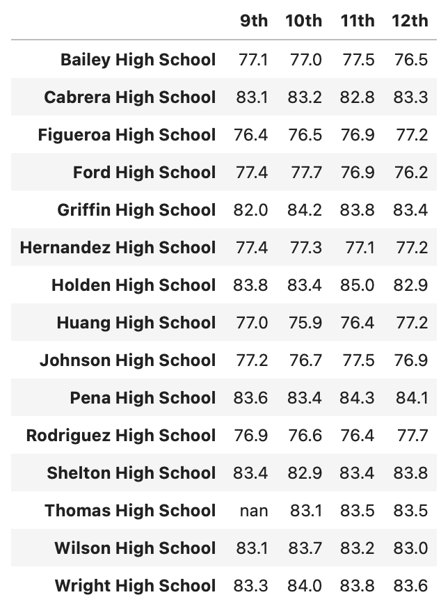
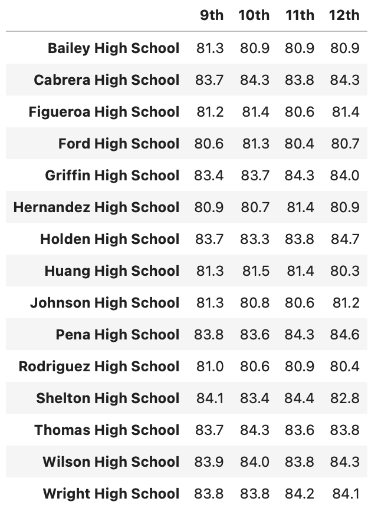
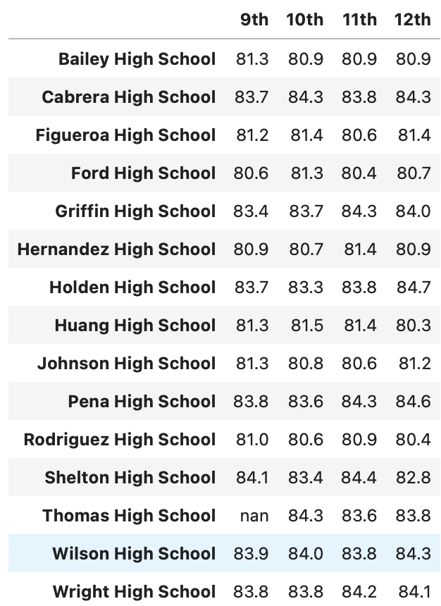
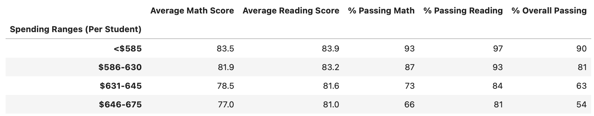
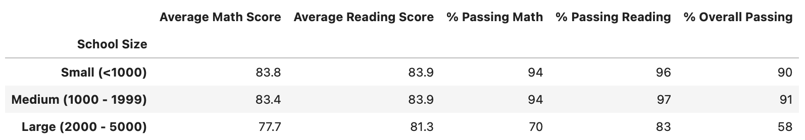
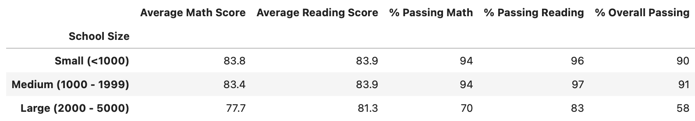
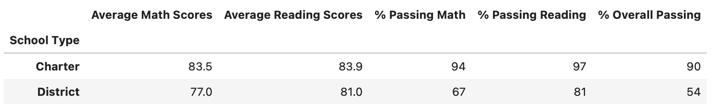
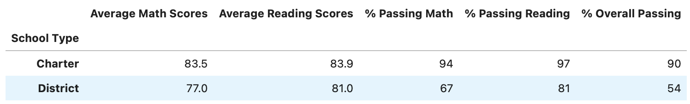

# School District Analysis

## Overview of the project:
There is some evidence of academic dishonesty which affect the data source, this analysis is to remove the affected data which are the math and reading scores for Thomas High School (THS) 9th graders, and to find out this change will affect the original version of the analysis.

# Results

1. District summary

 The original analysis of district summary 

 The updated analysis of district summary 

- Average math score is down 0.1
- Average reading score didn't change
- % passing math is down 0.2%
- % passing reading is down 0.3%
- % overall passing is down 0.1%

From the results, we can see that the changes in THS 9th graders have affected very little on the district summary results.

2. School summary

 The original analysis of school summary 

 The updated (after removing THS 9th graders' scores) analysis of school summary 

 The updated (recalculate THS data with only students in 10th-12th grades and their scores) analysis of school summary 

After removing THS 9th graders' scores:

- Average math score is up about 0.1
- Average reading score is up about 0.05
- % passing math is down about 26%
- % passing reading is down about 27%
- % overall passing is down about 25%

From the first two images we can see replacing the THS 9th graders' scores has a big impact on the school's overall performance, the percentage of passing math/reading and overall passing dropped significantly, and this change puts THS from one of the top runner in the district to one of the lower ones.

In the third image, we dropped the 9th graders altogether, and calculate only the students who are in 10th - 12th grades, and from that, we can see THS's overall performance is very similar to the original analysis, and bring the overall performance back to one of the top runner position.

3. Math and reading scores by grade

The math and reading scores by grade analysis result shows that it didn't change any other school or grades other than the 9th grade of THS, in which the values now are NaNs.

4. Scores by school spending
 The original analysis of scores by school spending

 The updated analysis of scores by school spending 

The change of THS 9th graders didn't change the result of scores by school spending.

5. Scores by school size
 The original analysis of scores by school size 

 The updated analysis of scores by school size 

The change of THS 9th graders didn't change the result of scores by school size.

6. Scores by school type
 The original analysis of scores by school type 

 The updated analysis of scores by school type 

The change of THS 9th graders didn't change the result of scores by school type.

# Summary
With replacing THS 9th graders' scores, 
- the district summary was affected slightly.
- school summary has significant changes but after we recalculated the data by excluding THS 9th graders, it only changed by a small margin.
- the values of math scores by grade for THS 9th grade are replaced by NaN.
- the values of reading scores by grade for THS 9th grade are replaced by NaN.
