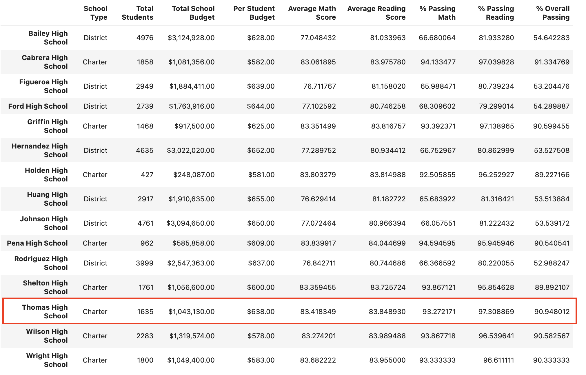

# School District Analysis

## Overview of the project:
There are some evidence of academic dishonesty which affect the data source, this analysis is to remove the affected data which are the math and reading scores for Thomas High School (THS) 9th graders, and to find out out this change will affect the original version of the analysis.

# Results

### 1. District summary

 The original analysis of district summary 

 The updated analysis of district summary 

- Average math score is down 0.1

- Average reading score didn't change

- % passing math is down 0.2%

- % passing reading is down 0.3%

- % overall passing is down 0.1%

From the results we can see that the changes of THS 9th graders have affected very little on the district summary results.

### 2. School summary

 The original analysis of school summary 

 The updated analysis of school summary 

